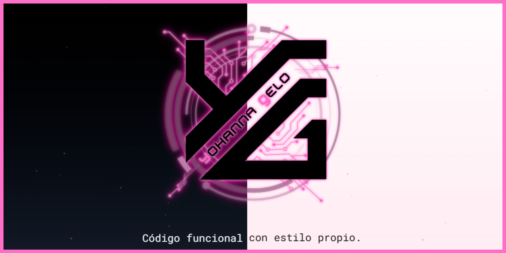

  

# 👩🏻‍💻 ¡Hola! Soy Yohanna Gelo

Apasionada por el desarrollo web y la creación de experiencias útiles y bien cuidadas.  
Tras una etapa autodidacta, decidí estudiar y reinventarme. Hoy soy desarrolladora full stack en formación, con muchas ganas de seguir creciendo 💪

🎓 Técnica Superior en Desarrollo de Aplicaciones Web (DAW)  
🧠 Creativa, resolutiva y con iniciativa propia  
🌐 Portfolio → [https://yohannagelo.github.io](https://yohannagelo.ruix.iesruizgijon.es)

---

## 🛠️ Tecnologías con las que trabajo

- HTML, CSS, Sass, Bootstrap
- JavaScript, TypeScript
- Angular, Laravel, PHP, MySQL
- WordPress, Webempresa
- Git, GitHub, APIs REST
- Cloudinary, Toastr, Cookies, Sesiones...

---

## 🚀 Algunos proyectos destacados

| Proyecto | Descripción |
|---------|-------------|
| 🎓 [Ruiz Gijón Conecta](https://yohannagelo.ruix.iesruizgijon.es/rgconecta) | Proyecto final DAW 2025: plataforma para conectar alumnado con docentes del IES Ruiz Gijón. |
| 🧩 [Hackathon Utrera 2025](https://yohannagelo.ruix.iesruizgijon.es/hackathonUtrera/) | Proyecto ganador en la edición 2025. |
| 🧪 [GeloTech Angular + API PHP](https://yohannagelo.ruix.iesruizgijon.es/geloTech/) | App Angular conectada a una API desarrollada en PHP puro. |
| 🏫 [Web CEIP Alfonso de Orleans](https://www.ceipalfonsodeorleans.es/) | Proyecto personal previo a mi formación, desarrollado con WordPress. |

---

## 📊 Mis estadísticas en GitHub

  
  

---

## 📬 Contacto

- 🌐 [Portfolio completo](https://yohannagelo.ruix.iesruizgijon.es)
- 💼 [LinkedIn](https://www.linkedin.com/in/yohannagelo/)
- 📧 Email: **yohannagelo@gmail.com**

---

> “Siempre intento aportar algo más, incluso cuando no se exige.”
